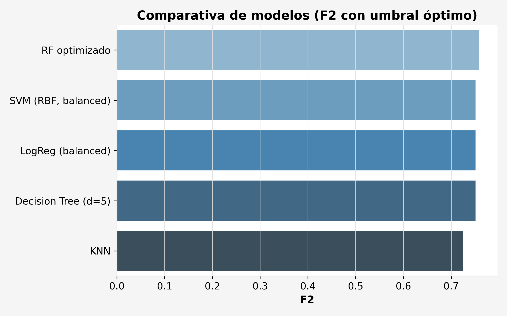
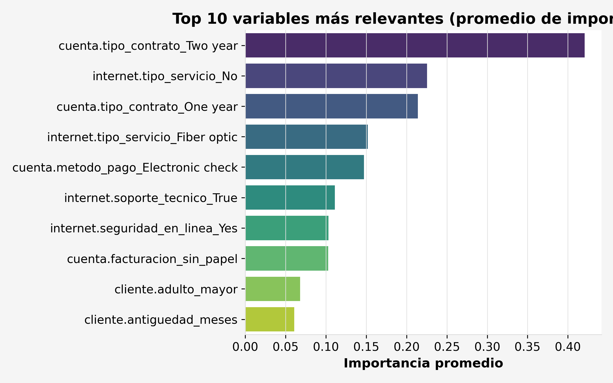
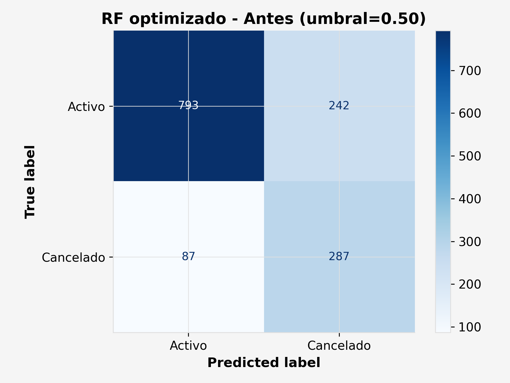
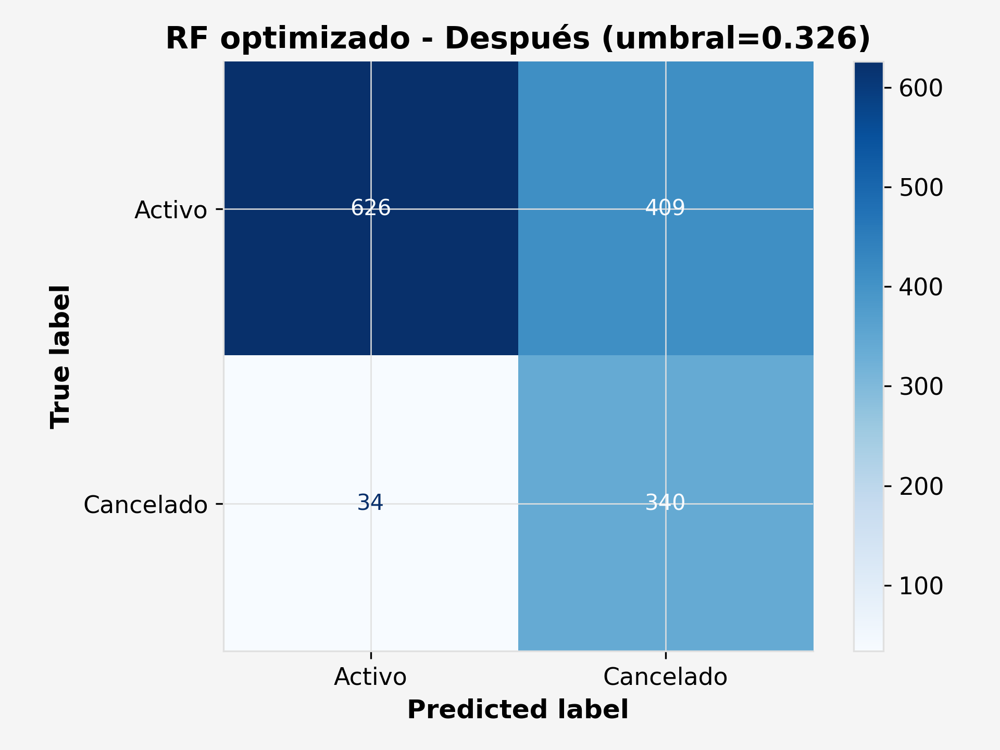

# 📊 Proyecto de Predicción de Churn de Clientes

## 📌 Objetivo
Desarrollar un sistema de **clasificación de churn (cancelación de clientes)** que permita a la empresa identificar clientes con alta probabilidad de cancelar sus servicios, priorizando el **recall** para maximizar la detección de casos de riesgo.

---

## 1️⃣ Importación y exploración de datos
- **Dataset**: `datos_final` (`.csv`) con 7,043 registros y 29 columnas.
- **Variables**:
  - **Objetivo**: `cliente.abandono` (0 = activo, 1 = cancelado).
  - **Categóricas**: tipo de contrato, tipo de servicio de internet, método de pago, etc.
  - **Numéricas**: cargos mensuales, cargos totales, antigüedad, etc.
- **Exploración inicial**:
  - Identificación de tipos de datos (`int64`, `float64`, `object`).
  - Verificación de valores faltantes.
  - Distribución de la variable objetivo: **73.46% activos vs 26.54% cancelados**.

---

## 2️⃣ Preparación de datos
- **Limpieza**:
  - Eliminación de columnas redundantes (multicolinealidad).
  - Tratamiento de valores nulos.
- **Transformación**:
  - Variables categóricas → One-Hot Encoding (`pd.get_dummies`).
  - Escalado de variables numéricas (`StandardScaler`) para KNN y SVM.
- **Manejo del desbalance**:
  - Uso de `class_weight="balanced"` en modelos compatibles.
  - Pruebas con SMOTE (oversampling sintético) y undersampling, optando finalmente por `class_weight`.

---

## 3️⃣ División de datos
- **Train/Test Split**:
  - 80% entrenamiento / 20% prueba.
  - Estratificación para mantener la proporción de la variable objetivo.

---

## 4️⃣ Modelos evaluados
### Modelos base
1. **Regresión Logística** (`class_weight=balanced`)
2. **Árbol de Decisión** (`class_weight=balanced`)
3. **Random Forest** (`class_weight=balanced_subsample`)

### Modelos añadidos
4. **KNN** (`n_neighbors=21`, `weights="distance"`)
5. **SVM** (`kernel="rbf"`, `class_weight="balanced"`, `probability=True`)

---

## 5️⃣ Ajuste de umbral
- **Métrica objetivo**: **F2** (prioriza recall sobre precisión).
- **Reglas de negocio**:
  - Recall ≥ 0.85
  - Precisión ≥ 0.40
- **Procedimiento**:
  1. Calcular probabilidades (`predict_proba`).
  2. Evaluar métricas para umbrales entre 0.05 y 0.95.
  3. Seleccionar el umbral que maximiza F2 cumpliendo las reglas.
  4. Comparar todos los modelos con su umbral óptimo.

---

## 6️⃣ Optimización del Random Forest
- **Búsqueda de hiperparámetros**:
  - `n_estimators`: [200, 300, 400]
  - `max_depth`: [4, 5, 6, 8]
  - `min_samples_leaf`: [1, 2, 5]
- **Mejor configuración**:
```python
from sklearn.ensemble import RandomForestClassifier

rf_final = RandomForestClassifier(
    n_estimators=200,
    max_depth=8,
    min_samples_leaf=5,
    class_weight='balanced_subsample',
    random_state=42,
    n_jobs=-1
)
```
- **Umbral óptimo**: `0.326`  
- **Métricas finales**:  
  - Precisión: `0.4547`  
  - Recall: `0.9118`  
  - F2: `0.7591`

---

## 7️⃣ Comparativa final de modelos (umbral óptimo)

| Modelo                | Umbral | Precisión | Recall  | F2     |
|-----------------------|--------|-----------|---------|--------|
| **RF optimizado**     | 0.326  | **0.4547**| 0.9118  | **0.7591** |
| SVM (RBF, balanced)   | 0.100  | 0.4282    | **0.9251** | 0.7509 |
| LogReg (balanced)     | 0.334  | 0.4358    | 0.9171  | 0.7512 |
| Decision Tree (d=5)   | 0.331  | 0.4111    | 0.9465  | 0.7510 |
| KNN                   | 0.134  | 0.4038    | 0.9037  | 0.7244 |



---

## 8️⃣ Análisis de importancia de variables

**Métodos utilizados:**
- **Regresión Logística**: magnitud de coeficientes.
- **Random Forest**: `feature_importances_`.
- **KNN y SVM**: `permutation_importance`.

**Top variables globales** (promedio de importancias):
1. `cuenta.tipo_contrato_Two year` → factor protector más fuerte.
2. `internet.tipo_servicio_No` → menor churn sin internet.
3. `cuenta.tipo_contrato_One year` → también reduce churn, aunque menos que 2 años.
4. `internet.tipo_servicio_Fiber optic` → mayor riesgo de cancelación.
5. `cuenta.metodo_pago_Electronic check` → mayor riesgo.
6. `internet.soporte_tecnico_True` → reduce churn.
7. `internet.seguridad_en_linea_Yes` → reduce churn.



---

## 9️⃣ Matriz de confusión antes y después del ajuste (RF optimizado)

**Antes del ajuste (umbral = 0.50):**


**Después del ajuste (umbral = 0.326):**


---

## 🔟 Recomendaciones de negocio

1. **Promover contratos de 2 años** para aumentar retención.
2. **Revisar calidad del servicio de fibra óptica** y reducir incidencias.
3. **Fomentar métodos de pago automáticos** para reducir riesgo asociado a “Electronic check”.
4. **Incentivar contratación de soporte técnico y seguridad en línea**.
5. **Aplicar el modelo mensualmente** para identificar clientes en riesgo y priorizar intervenciones.

---

## 📎 Herramientas y librerías

- **Lenguaje**: Python 3.x
- **Librerías principales**:
  - `pandas`, `numpy` → manejo de datos
  - `matplotlib`, `seaborn` → visualización
  - `scikit-learn` → modelado y evaluación
- **Métodos adicionales**:
  - One-Hot Encoding
  - StandardScaler
  - Permutation Importance
